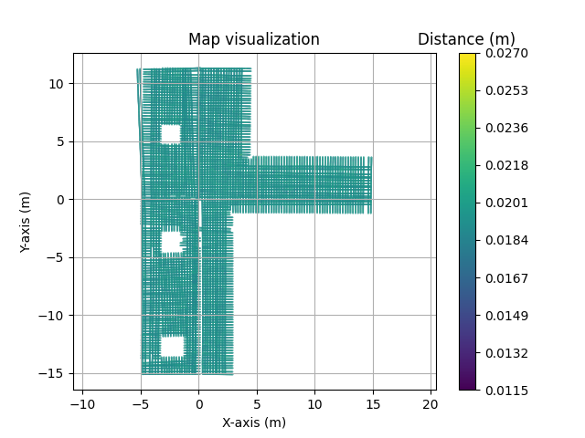
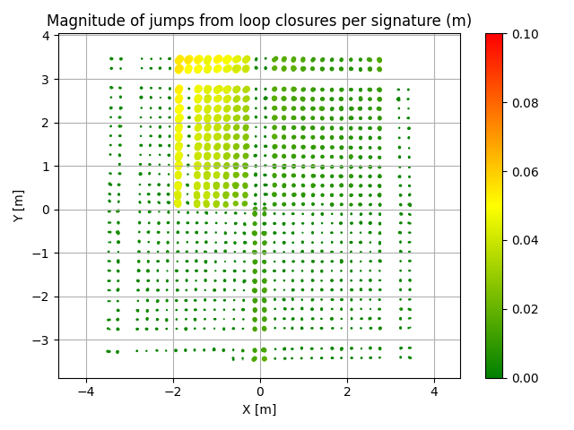
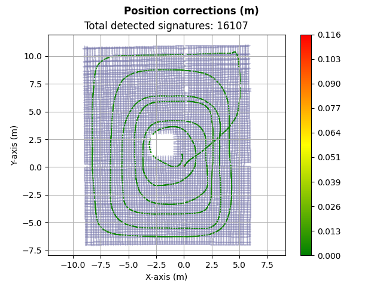

# Robotics-SLAM-analysis

Generating performance reports of SLAM positioning data. The robotics solution from PrimeVison uses these scripts to analyse the performance of the Accerion Triton Sensor. [Accerion Triton Solution](https://accerion.tech/solutions/triton/). I have worked closely with Accerion to provide high-quality data from our 40 locations in the United States, to improve their algorithms and software.

## Quick Usage

Input:
* floor_map_coordinates.csv: the csv with SLAM signature coordinates
* g2o_file.g2o: the pose graph optimization file
* arams_user_logs: the publicily available sensor logs from Accerion

Output:
* Generated Plots
* Automatically generated HTML file
* Automatically generated PDF file

```
python3 create_report.py -i floor_map_coordinates.csv g2o_file.g2o arams_user_logs -o results
```

## AMF analysis

AMF files is a propretiary database developed by Accerion. It includes individual signatures of their SLAM algorithm. We can analyse these using the CSV file generated when requesting the logs via the API.



## G2O 

From the posegraph optimization file we can analyse how the SLAM performed and if there are any large error in the positioning while mapping.



## Arams User Logs analysis

With the Arams User Logs we can analyse the quality of positioning after the initial SLAM is performed. For example we can analyse heading corrections, position corrections and velocity corrections. 

